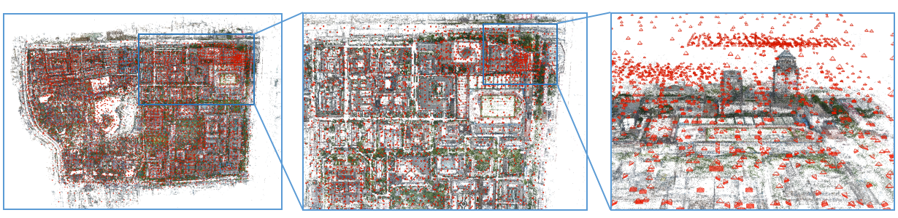

# Graph Structure from Motion (GraphSfM)
[](https://gitter.im/GraphSfM/Lobby)


**A similar version of GraphSfM based on [OpenMVG](https://github.com/openMVG/openMVG) has been released in: https://github.com/AIBluefisher/EGSfM.**

## 1. Overview of GraphSfM
Our Structure from Motion approach, named **`Graph Structure from Motion (GraphSfM)`**, is aimed at large scale 3D reconstruction. Besides, we aimed at exploring the computation ability of computer and making SfM easily transferred to distributed system. This work has been refactored, now it is based on [COLMAP](https://github.com/colmap/colmap). We have implemented the distributed version which is based on Map-Reduce architecture.

In our work, 3D reconstruction is deemed as a ```divide-and-conquer``` problem. Our graph cluster algorithm divides images into different clusters, while images with high relativity remained in the same group. After the completion of local SfM in all clusters, an elaborate graph initialization and MST construction algorithm is designed to accurately merge clusters, and cope well with drift problems. The two proposed graph-based algorithms make SfM more efficient and robust - the graph cluster algorithm accelerate the SfM step while guarantee the robustness of clusters merging, and the MST construction makes point clouds alignment as accurate as possible. Our approach can reconstruct large scale data-set in one single machine with very high accuracy and efficiency. Based on this work, we have been successfully reconstructed Peking University within 2 hours on a
laptop.



If you use this project for your research, please cite:
```
@misc{chen2019graphbased,
    title={Graph-Based Parallel Large Scale Structure from Motion},
    author={Yu Chen and Shuhan Shen and Yisong Chen and Guoping Wang},
    year={2019},
    eprint={1912.10659},
    archivePrefix={arXiv},
    primaryClass={cs.CV}
}

@inproceedings{schoenberger2016sfm,
    author={Sch\"{o}nberger, Johannes Lutz and Frahm, Jan-Michael},
    title={Structure-from-Motion Revisited},
    booktitle={Conference on Computer Vision and Pattern Recognition (CVPR)},
    year={2016},
}
```

## 2. How to Build

### 2.1 Required

#### Basic Requirements
```
sudo apt-get install \
    git \
    cmake \
    build-essential \
    libboost-program-options-dev \
    libboost-filesystem-dev \
    libboost-graph-dev \
    libboost-regex-dev \
    libboost-system-dev \
    libboost-test-dev \
    libeigen3-dev \
    libsuitesparse-dev \
    libfreeimage-dev \
    libgoogle-glog-dev \
    libgflags-dev \
    libglew-dev \
    qtbase5-dev \
    libqt5opengl5-dev \
    libcgal-dev \
    libcgal-qt5-dev
```

#### [ceres-solver]()

```sh
sudo apt-get install libatlas-base-dev libsuitesparse-dev
git clone https://ceres-solver.googlesource.com/ceres-solver
cd ceres-solver
git checkout $(git describe --tags) # Checkout the latest release
mkdir build
cd build
cmake .. -DBUILD_TESTING=OFF -DBUILD_EXAMPLES=OFF
make
sudo make install
```

#### [rpclib](https://github.com/qchateau/rpclib)

```sh
git clone https://github.com/qchateau/rpclib.git
cd rpclib
mkdir build && cd build
cmake ..
make -j8
sudo make install
```
#### Build our GraphSfM

```sh
git clone https://github.com/AIBluefisher/GraphSfM.git
cd GraphSfM
mkdir build && cd build
cmake .. && make -j8
```

## 3. Usage

As our algorithm is not integrated in the `GUI` of `COLMAP`, we offer a script to run the 
distributed SfM (We hope there is anyone that is interested in integrating this pipeline into the GUI).

### Sequential Mode
```sh
sudo chmod +x scripts/shell/distributed_sfm.sh
./distributed_sfm.sh $image_dir $num_images_ub $log_folder $completeness_ratio
```
- ```$image_dir```:   The directory that stores images
- ```$num_images_ub```: The maximum image number in each cluster. For example, ```80~120```.
- ```$log_folder```:  The directory that stores the logs
- ```$completeness_ratio```: The ratio that measure the repeatitive rate of adjacent clusters.

### Distributed Mode
(1) At first, we need to establish the server for every worker: 
```sh
cd build/src/exe
./colmap local_sfm_worker --output_path=$output_path
```

(2) Then, the ip and port for every server should be written in a `config.txt` file.
The file format should follow:
```txt
server_num
ip1 port1 image_path1
ip2 port2 image_path2
... ...
```

(3) At last, start our master
```sh
cd GraphSfM_PATH/scripts/shell
# The project folder must contain a folder "images" with all the images.
DATASET_PATH=/path/to/project
CONFIG_FILE_PATH=/path_to_config_file
num_images_ub=100
log_folder=/path_to_log_dir

./distributed_sfm sh $DATASET_PATH $num_images_ub $log_folder $CONFIG_FILE_PATH
```

The `distributed_sfm.sh` actually executes the following command in SfM module:
```sh
/home/chenyu/Projects/Disco/build/src/exe/colmap distributed_mapper \
$DATASET_PATH/$log_folder \
--database_path=$DATASET_PATH/database.db \
--transfer_images_to_server=1 \
--image_path=$DATASET_PATH/images \
--output_path=$DATASET_PATH/$log_folder \
--config_file_name=$CONFIG_FILE_PATH/config.txt \
--num_workers=8 \
--distributed=1 \
--repartition=0 \
--assign_cluster_id=1 \
--write_binary=1 \
--retriangulate=0 \
--final_ba=1 \
--select_tracks_for_bundle_adjustment=1 \
--long_track_length_threshold=10 \
--graph_dir=$DATASET_PATH/$log_folder \
--num_images_ub=$num_images_ub \
--completeness_ratio=0.7 \
--relax_ratio=1.3 \
--cluster_type=SPECTRA
```
The parameters need to be reset for different purpose:
- `--transfer_images_to_server`: The option decides whether to transfer images that are stored on
master's disk to workers' disks. If we want to execute a further MVS process, we want this option to be set to `1`, because each worker that execute MVS needs to access the raw images.

- `--distributed`: This option decides the SfM module runs in distributed mode or sequential mode.
For example, if we just have one computer, we should set it to `0`, then SfM would run in sequential mode and allows you to reconstruct large scale images on a single computer. If we set it to `1`, we must ensure the `--config_file_name` option is valid, so that we we run SfM among
a lot of computers, which in a really distributed mode.

- `assign_cluster_id`: We use this option to indicate the program to assign each image with a
`cluster_id`, if we divide images into several clusters. This option allows us to render different
image poses that are clustered in different clusters by different colors.

- `write_binary`: This option indicates to save the SfM results in text format or in binary format.

- `final_ba`: This option indicates whether to perform a final bundle adjustment after merging all
local maps. As a very large scale map requires much time to optimize scene structures and camera poses, users should tune this option by their need.

- `select_tracks_for_bundle_adjustment`: As the final bundle adjustment requires too much time, we can select good tracks to optimize and achieves a comparable accuracy as full bundle adjustment.

- `long_track_length_threshold`: The maximum track length when selects good tracks for bundle adjustment.

- `num_images_ub`: The maximum number of images in each cluster.

- `completeness_ratio`: This option indicate the overlapping between clusters. 0.5~0.7 is enough 
in practice.

- `cluster_type`: This option decides which cluster method we choose for image clustering. We support `NCut` and `Spectral` Clustering. `Spectra` clustering is more accurate than `NCut` but
it would be slow if we want to divide images into many clusters, as it needs much time to compute
eigen vectors.

If succeed, camera poses and sparse points should be included in `$DATASET/Master` folder, you can use COLMAP's GUI to 
import it and show the visual result:
```sh
./build/src/exe/colmap gui
```
For small scale reconstruction, you can set the `$num_images_ub` equal to the number of images, the program would just use the incremental SfM pipeline of [COLMAP](https://github.com/colmap/colmap).

For large scale reconstruction, our `GraphSfM` is highly recommended, these parameters should be tuned carefully: larger `$num_images_ub` and `$completeness_ratio` can make reconstruction more robust, but also may lead to low efficiency and even degenerate to incremental one.

## ChangeLog

- 2020.04.10
    - Spectral clustering for image clustering.
    - Select good tracks for final bundle adjustment.
    - Image transfer from master to workers.
    - Extract largest connected component for Structure-from-Motion.

- 2020.03.06
    - Assign different colors for images in different clusters.
    - Support rendering image poses by different colors in ui.
    - map reduce implementation for distributed Structure-from-Motion.

- 2019.11.26
    - Image Clustering algorithms: NCut, Spectral Clustering (Updated in latest version).
    - Graph-based sub-reconstruction Merging algorithm.


## Licence

```
BSD 3-Clause License

Copyright (c) 2018, 陈煜
All rights reserved.

Redistribution and use in source and binary forms, with or without
modification, are permitted provided that the following conditions are met:

* Redistributions of source code must retain the above copyright notice, this
  list of conditions and the following disclaimer.

* Redistributions in binary form must reproduce the above copyright notice,
  this list of conditions and the following disclaimer in the documentation
  and/or other materials provided with the distribution.

* Neither the name of the copyright holder nor the names of its
  contributors may be used to endorse or promote products derived from
  this software without specific prior written permission.

THIS SOFTWARE IS PROVIDED BY THE COPYRIGHT HOLDERS AND CONTRIBUTORS "AS IS"
AND ANY EXPRESS OR IMPLIED WARRANTIES, INCLUDING, BUT NOT LIMITED TO, THE
IMPLIED WARRANTIES OF MERCHANTABILITY AND FITNESS FOR A PARTICULAR PURPOSE ARE
DISCLAIMED. IN NO EVENT SHALL THE COPYRIGHT HOLDER OR CONTRIBUTORS BE LIABLE
FOR ANY DIRECT, INDIRECT, INCIDENTAL, SPECIAL, EXEMPLARY, OR CONSEQUENTIAL
DAMAGES (INCLUDING, BUT NOT LIMITED TO, PROCUREMENT OF SUBSTITUTE GOODS OR
SERVICES; LOSS OF USE, DATA, OR PROFITS; OR BUSINESS INTERRUPTION) HOWEVER
CAUSED AND ON ANY THEORY OF LIABILITY, WHETHER IN CONTRACT, STRICT LIABILITY,
OR TORT (INCLUDING NEGLIGENCE OR OTHERWISE) ARISING IN ANY WAY OUT OF THE USE
OF THIS SOFTWARE, EVEN IF ADVISED OF THE POSSIBILITY OF SUCH DAMAGE.
```
