# Graph Structure from Motion (GSfM)

## 1. Introduction of GSfM

We extend the original incremental SfM approach into a divide-and-conquer approach. Our approach is much more efficient than state-of-the-art open-source SfM systems ([COLMAP](https://github.com/colmap/colmap), [OpenMVG](https://github.com/openMVG/openMVG), [TheiaSfM](https://github.com/sweeneychris/TheiaSfM)), while surpass the accuracy of them at the same time. The pipeline of our GSfM is shown below:

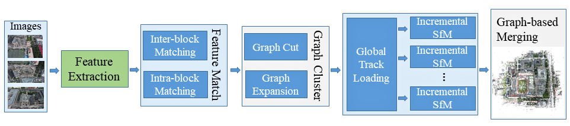

Thanks to our adaptive graph cluster algorithm, the images are divided into different groups. The images with strong connections are divided in the same group. And strong/weak MST conditions are used to enhance the connections between different clusters. After that, a robust incremental SfM approach (Based on an early version of [OpenMVG](https://github.com/openMVG/openMVG)) is performed in each cluster. While different clusters located in different reference systems, our graph-based merging algorithm is designed to automatically align the point clouds efficiently. Thus, our SfM approach is named ```GSfM```.


## 2. Results

### 2.1. Campus 


### 2.2. Guanzhou Stadium
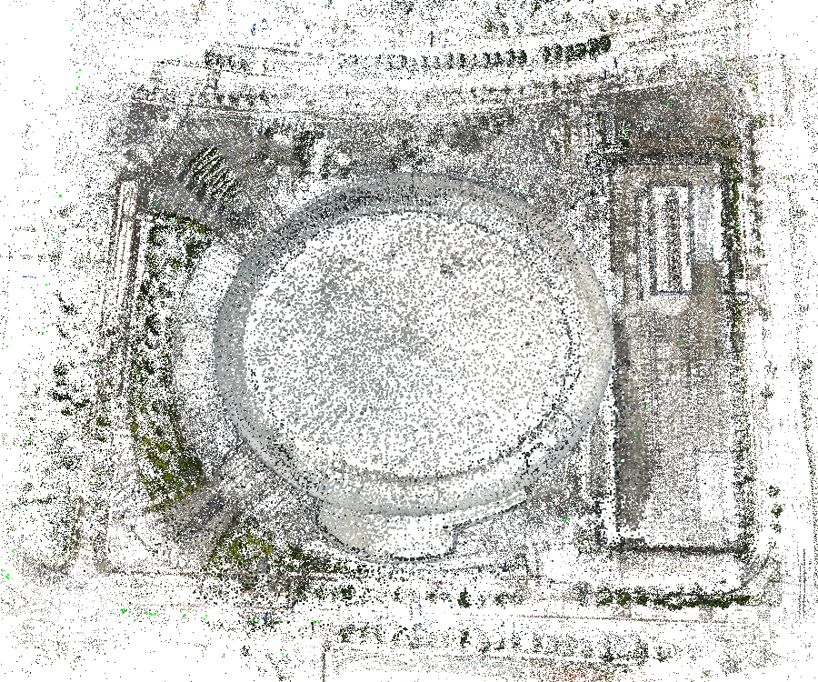


### 2.3. Haidian
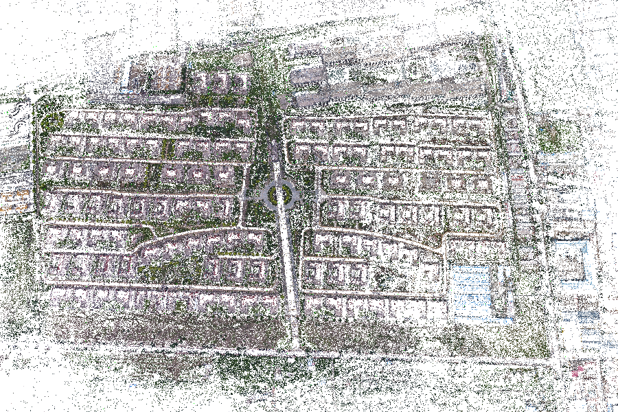

### 2.4. Gerrard Hall
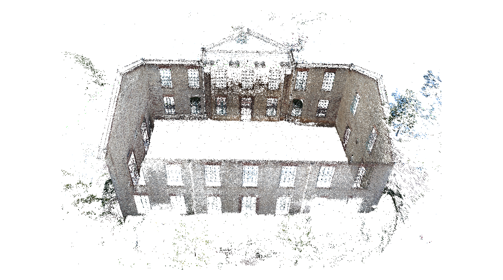


### 2.5. Person Hall

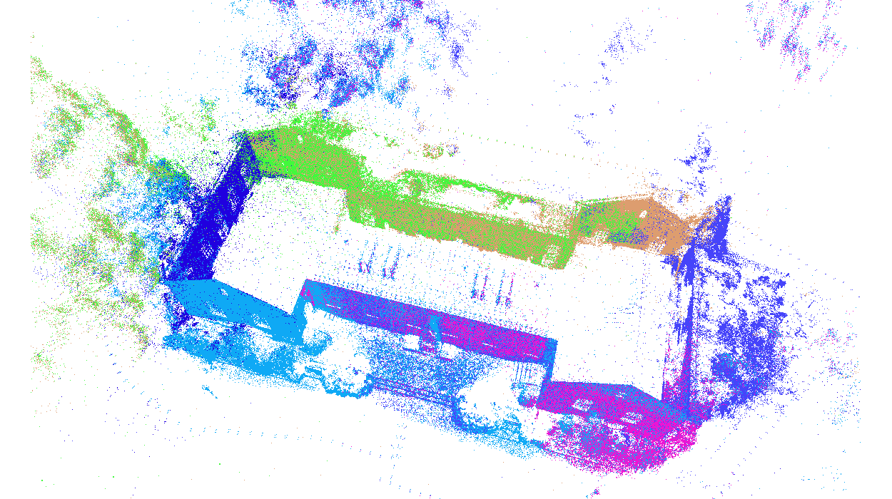

### 2.6. PKU All


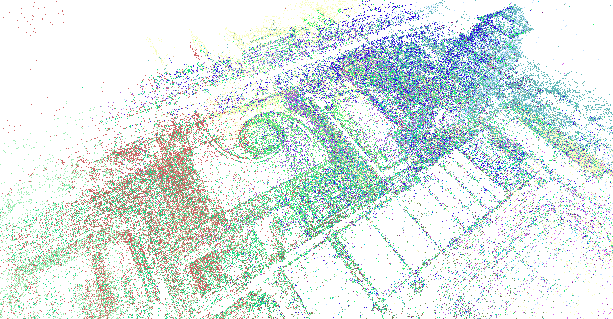


### 2.7. PKU e34

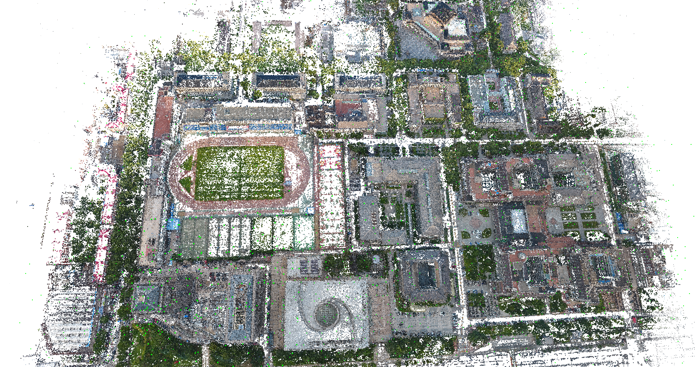
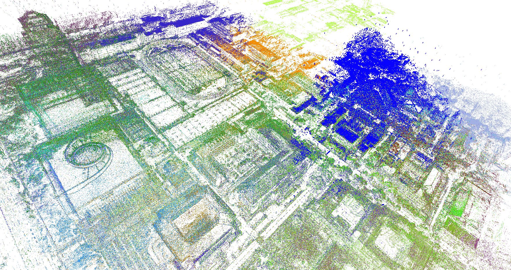


### 2.8. PKU Medium

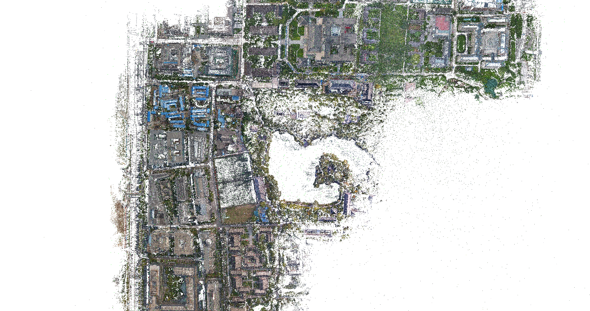
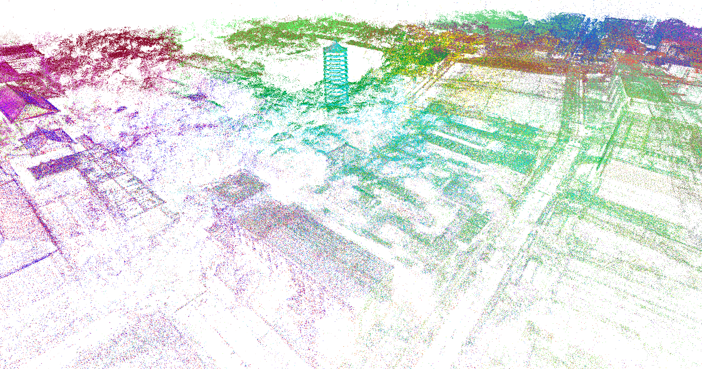
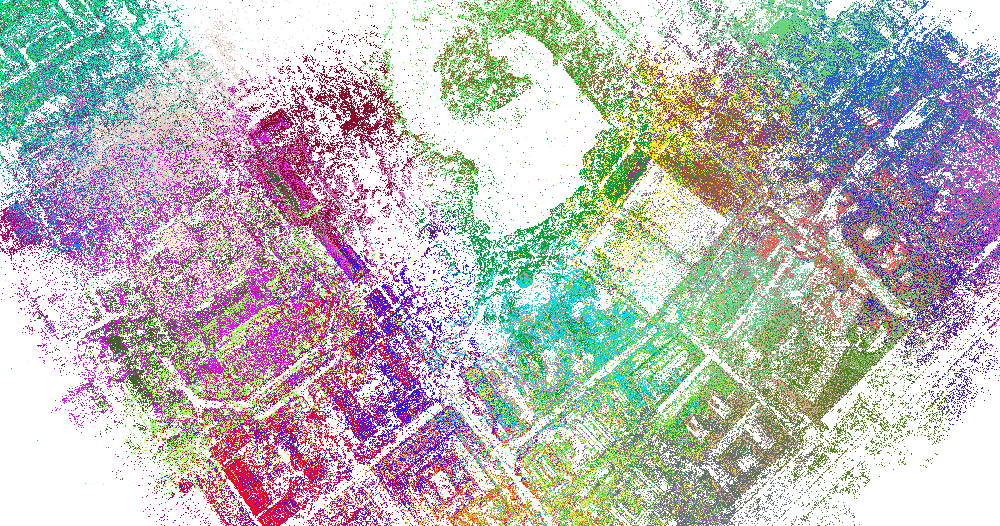


